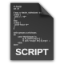

.. documentation-ltb documentation master file, created by
   sphinx-quickstart on Fri Aug 27 19:12:12 2021.
   You can adapt this file completely to your liking, but it should at least
   contain the root `toctree` directive.

Welcome to project-ltb's documentation
======================================

.. toctree::
   :maxdepth: 1
   :caption: General LDAP Howtos

   auth_ldap_best_practices
   active_directory_certificates
   sasl_delegation
   migrate_slapd_conf_cn_config
   openldap_ssl_tls_mutual_authentication

.. toctree::
   :maxdepth: 1
   :caption: OpenLDAP packaging

   openldap-rpm
   openldap-deb
   slapd-cli

.. toctree::
   :maxdepth: 1
   :caption: OpenLDAP overlays and extensions

   openldap-ppm
   openldap-noopsrch

.. toctree::
   :maxdepth: 1
   :caption: Web applications

   self-service-password
   white-pages
   service-desk

.. toctree::
   :maxdepth: 1
   :caption: Monitoring: Nagios plugins

   check_ldap_dn
   check_ldap_time
   check_ldap_syncrepl_status
   check_ldap_query
   check_ldap_monitor
   check_ldap_monitor_389ds
   check_lmdb_usage
   restart_slapd

.. toctree::
   :maxdepth: 1
   :caption: Statistics with Cacti

   ldap_response_time
   openldap_operations

.. toctree::
   :maxdepth: 1
   :caption: LDAP scripts

   checkldappwdexpiration
   cleanldapbrokenaliases
   file2ldif
   ldap-stats

Indices and tables
==================

* :ref:`genindex`
* :ref:`modindex`
* :ref:`search`
