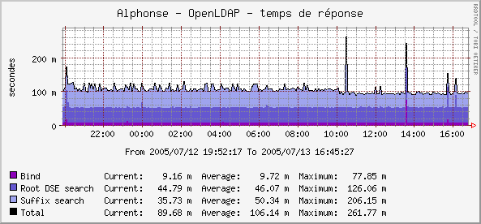

******************
LDAP response time
******************

Presentation
============

This Cacti script measures LDAP response times on 3 operations:

    * A bind
    * A search on the RootDSE
    * A search on a naming context

Here is a generated graph example:

.. include:: download-plugins.rst

Installation
============

You have to copy the perl script in Cacti scripts directory (for example ``/usr/share/cacti/site/scripts/`` on Debian):

.. code-block:: console

   $ cp ldap_response_time.pl /usr/share/cacti/site/scripts/

Then go on Cacti administration panel and choose *"Import template"*. Select the XML local file shipped with the script and *"save"*.

Configuration
=============

You can edit the values of command line parameters by modifying the Data source template.

Choose *"Data Templates"* and click on *"LDAP - response time"*. You can see at the bottom the *"Custom Data"* table. Parameters are:

    * Host or IP
    * Port
    * Connection account: anonymous bind if not defined
    * Connection password
    * Timeout
    * LDAP protocol version
    * Suffix: *"auto"* means the script will discover the naming context from the rootDSE. You can also specify one naming context here (for example *"dc=example,dc=com"*), or use *"none"* to disable searching on the suffix (useful for LDAP proxies).

Data source creation
====================

In the Cacti admin panel, choose *"Data Sources"* and click on *"Add"*.

Select the *"LDAP - response time"* Data template, the host, and *"save"*.

Graph creation
==============

In the Cacti admin panel, choose *"Graph Management"* and click on *"Add"*.

Select the *"LDAP - response time"* Graph template, the host, associate the data sources and *"save"*.

