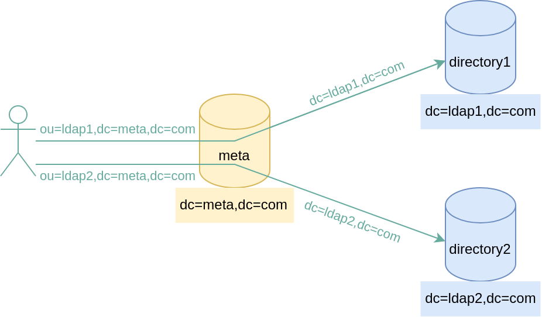
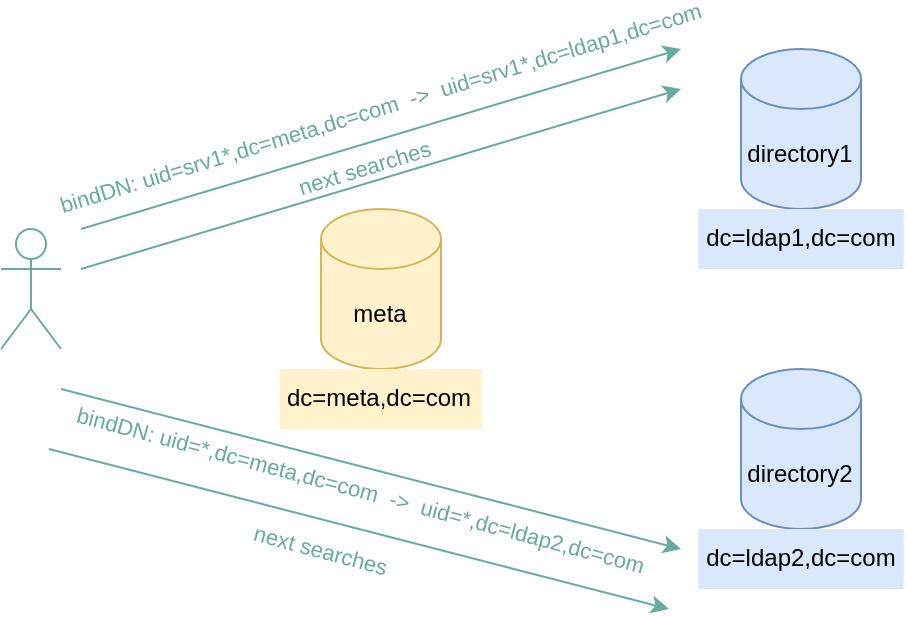

*************************************************
Meta directory and suffix rewriting with OpenLDAP
*************************************************

Presentation
============

One of the main strengths of OpenLDAP is its extensibility:

* via storage plugins: the **backends**
* via plugins adding new features : the **overlays**

Even if the prime objective of OpenLDAP backends is to define and configure the physical storage of the directory, it also exists backends allowing to made it a LDAP proxy.

For example, it is the case for these backends:

* `ldap <https://www.openldap.org/software/man.cgi?query=slapd-ldap>`_: LDAP proxy
* `meta <https://www.openldap.org/software/man.cgi?query=slapd-meta>`_: meta directory, combining data from multiple LDAP sources
 
The last one is especially interesting, as it offers to merge data from several directories, for presenting a unified view to applications that cannot handle multiple instances.

This feature also asks questions: how to homogenize data from heterogeneous directories? How to concilitate different or even incompatible directory schemas? (for example merging Active Directory, Oracle Directory Server, ITDS,...) The answer to these questions can be found in the configuration of the `ldap <https://www.openldap.org/software/man.cgi?query=slapd-ldap>`_ and `meta <https://www.openldap.org/software/man.cgi?query=slapd-meta>`_ backends, and by the use of the `rwm <https://www.openldap.org/software/man.cgi?query=slapo-rwm>`_ overlay.

Simple meta directory
=====================

In this case, the data of directory 1 are virtually combined in a branch ou=ldap1, and ou=ldap2 for directory 2.

The routing criterion is quite simple, and there is no ambiguity.

Such a configuration can be achieved with the following file:

::

    include         /usr/local/openldap/etc/openldap/schema/core.schema
    include         /usr/local/openldap/etc/openldap/schema/cosine.schema
    include         /usr/local/openldap/etc/openldap/schema/inetorgperson.schema

    logLevel 256

    pidfile         slapd.pid
    argsfile        slapd.args

    moduleload      back_meta.la
    moduleload      back_ldap.la

    access to * by * write

    # Database
    database        meta
    suffix          "dc=meta,dc=com"
    rootdn          "cn=Manager,dc=meta,dc=com"
    rootpw          secret

    # LDAP 1
    uri             ldap://ldap1.example.com/ou=ldap1,dc=meta,dc=com
    suffixmassage   "ou=ldap1,dc=meta,dc=com" "dc=ldap1,dc=com"

    # LDAP 2
    uri             ldap://ldap2.example.com/ou=ldap2,dc=meta,dc=com
    suffixmassage   "ou=ldap2,dc=meta,dc=com" "dc=ldap2,dc=com"

Here, the important parameter is **suffixmassage**. It allows to intercept the requests with suffix ``ou=ldap1,dc=meta,dc=com`` on meta directory, and to rewrite them into ``dc=ldap1,dc=com``. Furthermore, it also does the opposite: the answers from ldap1 and ldap2 directories are rewritten too, this time from ``dc=ldap1,dc=com`` into ``ou=ldap1,dc=meta,dc=com``.

For more information on the meta parameters, you can read the `meta manual page <https://www.openldap.org/software/man.cgi?query=slapd-meta>`_

Also note the access rule (ACL) ``access to * by * write``. Often, one consider that the access rules are already managed at backend side, and it is thus sufficient to define a very loose rule to authorize any access in the meta directory.

In this simple scenario, we consider that the schema (the attributes and object classes) are identical on all the directories. Obviously, it rarely happens, and one must then choose between two strategies:

* import all schemas from backends into the meta directory
* rewrite the attributes of backends in order to homogenize the schema

The latter point will be discussed afterwards.

Meta directory with schema rewriting
====================================

This use case illustrates a meta directory virtualizing two Active Directory servers.

For simplicity, the only object rewritten here is the user.

::

    include         /usr/local/openldap/etc/openldap/schema/core.schema
    include         /usr/local/openldap/etc/openldap/schema/cosine.schema
    include         /usr/local/openldap/etc/openldap/schema/inetorgperson.schema

    logLevel 256

    pidfile         slapd.pid
    argsfile        slapd.args

    moduleload      back_meta.la
    moduleload      back_ldap.la

    access to * by * write

    # Database
    database        meta
    suffix          "dc=meta,dc=com"
    rootdn          "cn=Manager,dc=meta,dc=com"
    rootpw          secret

    # LDAP 1
    uri             ldap://ldap1.example.com/ou=ldap1,dc=meta,dc=com
    suffixmassage   "ou=ldap1,dc=meta,dc=com" "dc=LDAP1,dc=COM"

    # LDAP 2
    uri             ldap://ldap2.example.com/ou=ldap2,dc=meta,dc=com
    suffixmassage   "ou=ldap2,dc=meta,dc=com" "dc=LDAP2,DC=COM"

    map objectclass user inetOrgPerson
    map attribute uid sAMAccountName
    map attribute employeeNumber employeeID
    map attribute o userPrincipalName
    map attribute cn cn
    map attribute sn sn
    map attribute givenName givenName
    map attribute displayName displayName
    map attribute telephoneNumber telephoneNumber
    map attribute mail mail
    map attribute *

The beginning of the configuration is identical.

Every attribute name is rewritten from its local to its remote value during the request, and the opposite during the response.

The last parameter ``map attribute *`` allows to remove any attribute that is not listed.

You can read the `rwm manual page <https://www.openldap.org/software/man.cgi?query=slapo-rwm>`_ for more details about the attribute and objectclass rewritting.

Meta directory with balancing depending on the bindDN
=====================================================

Even if the meta engine can solve most of the administrators use cases, it can happen that a more complex issue exceeds its capacities.

It's the case for this particular need: balance the trafic on a directory or another depending on the bindDN used for authentication.

The rule is: persons connecting with uid stating with srv1 must be routed to LDAP1 server, and others must be routed to LDAP2 server.

Here, the complexity is that even if the authentication request is the first one, the next requests (search, add, modification) must be routed the same way, and thus the server must remember the information of the person who has connected at first.

To deal with this use case, the meta backend is not sufficient, we need to use the ``rwm`` overlay.

.. note::

    The meta backend has its own rewrite engine. However, in this situation it is inappropriate because the rewrite rules are applied per-target (meaning: per remote server). In our case, we need the rewrite rule to be applied upstream in order to chose the correct target backend.

To deal with this issue, we are using the rwm overlay declared before any backend:

::

    include         /usr/local/openldap/etc/openldap/schema/core.schema
    include         /usr/local/openldap/etc/openldap/schema/cosine.schema
    include         /usr/local/openldap/etc/openldap/schema/inetorgperson.schema

    logLevel 256

    pidfile         slapd.pid
    argsfile        slapd.args

    moduleload      back_meta.la
    moduleload      back_ldap.la
    moduleload      rwm.la

    access to * by * write

    overlay rwm
    rewriteEngine on

    # In the context of a BIND operation
    rewriteContext bindDN
    # Store user who has logged in an internal variable named binddn (for other LDAP operations)
    rwm-rewriteRule ".+" "${&&binddn($0)}$0" ":"
    # If the LDAP operation is a bind, directly rewrite the binddn
    # If binddn starts by or srv1, rewrite suffix to directory1
    rewriteRule "^uid=(srv1[^,]+)(.*),dc=domain,dc=com$" "uid=$1$2,dc=directory1,dc=domain,dc=com" ":@I"
    # Else, rewrite suffix to directory2
    rewriteRule "^uid=([^,]+)(.*),dc=domain,dc=com$" "uid=$1$2,dc=directory2,dc=domain,dc=com" ":@I"

    # For SEARCH LDAP operations
    rewriteContext searchDN
    # Prefix the string to search by the binddn who has connected previously
    rewriteRule "(.*)" "${**binddn}<>$1" ":I"
    # If binddn starts by srv1, remove binddn prefix from string and rewrite suffix to directory1
    rewriteRule "^uid=srv[^,]+,[^<]+<>(.*)dc=domain,dc=com(.*)$" "$1dc=directory1,dc=domain,dc=com$2" ":@I"
    # If binddn not found or does not start by srv1, remove binddn prefix from string and rewrite suffix to directory2
    rewriteRule "^.*<>(.*)dc=domain,dc=com(.*)$" "$1dc=directory2,dc=domain,dc=com$2" ":@I"
    rewriteRule "^.*<>(.*)$" "$1" ":@I"

    # For SEARCH entry operation during the response
    rewriteContext searchEntryDN
    rewriteRule "^(.*)dc=directory.,dc=domain,dc=com$" "$1dc=domain,dc=com" ":@I"

    database      meta

    suffix        "dc=domain,dc=com"

    uri           "ldap://127.0.0.1:3390/dc=directory1,dc=domain,dc=com"
    uri           "ldap://127.0.0.1:3391/dc=directory2,dc=domain,dc=com"

After the declaration of rwm overlay, the configuration is splitted in 3 sections:

* First section only applies during the authentication. It starts by storing the bindDN in a variable for later usage. Then it rewrites the suffix: persons whose uid is starting with srv1 are routed to directory 1, the other to directory 2.
* Second section applies in the case of a LDAP search. The search base is modified to include the bindDN of the person who has connected earlier. Then, if the person has an uid starting with srv1, the search base is rewritten to fit the one of directory 1, else it is rewritten to fit the one of directory 2.
* Last section allows to get the results from directory 1 and 2, and to rewrite them for the suffix to fit the one of meta directory.

Whereas is appears not really attractive at first, the syntax of a rewrite rule has always the same structure:

::

    rewriteRule "pattern" "replacement" "actions"

* **pattern** is a regular expression that will be verified according to the current context. In the case of ``rewriteContext bindDN``, it turns out to be the bind DN. In the case of ``rewriteContext searchDN``, it is the search base.
* **replacement** is the thing by which the pattern will be replaced. The usage of parenthesis in the pattern allows to get the corresponding values thanks to positional variables: $1, $2,...
* **actions** are control parameters. The most used are: ``:`` for applying the rule only once, ``@`` for applying the current rule if it maches (and not the following), ``I`` is for ignoring the potential errors.

For more information about the rwm parameters, you can read its `manual page <https://www.openldap.org/software/man.cgi?query=slapo-rwm>`_

