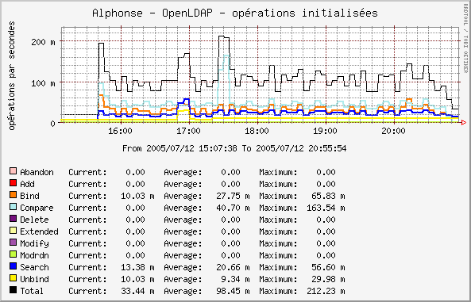

******************************
OpenLDAP operations statistics
******************************

Presentation
============

This Cacti script displays the number of initiated LDAP operations on an OpenLDAP server:

     * abandon
     * bind
     * unbind
     * compare
     * search
     * add
     * delete
     * modify
     * modrdn
     * extended

It uses statistics collected in OpenLDAP Monitor backend (*cn=monitor*).

Here is a generated graph example:

.. include:: download-plugins.rst

Installation
============

You have to copy the Perl script in the Cacti scripts directory (for example ``/usr/share/cacti/site/scripts/`` on Debian):

.. code-block:: console

   $ cp openldap_operations.pl /usr/share/cacti/site/scripts/

Then go to the Cacti administration panel and choose *"Import template"*. Select the XML local file shipped with the script and *"save"*.

Configuration
=============

You can edit the values of command line parameters by modifying the Data source template.

Choose *"Data Templates"* and click on *"LDAP - initiated operations"*. You can see at the bottom the *"Custom Data"* table. Parameters are:

     * Host or IP
     * Port
     * Connection account: anonymous bind if not defined
     * Connection password
     * Timeout
     * LDAP protocol version

Data source creation
====================

In the Cacti admin panel, choose *"Data Sources"* and click on *"Add"*.

Select the *"LDAP - initiated operations"* Data template, the host, and *"save"*.

Graph creation
==============

In the Cacti admin panel, choose *"Graph Management"* and click on *"Add"*.

Select the *"LDAP - initiated operations"* Graph template, the host, associate the data sources and *"save"*.

