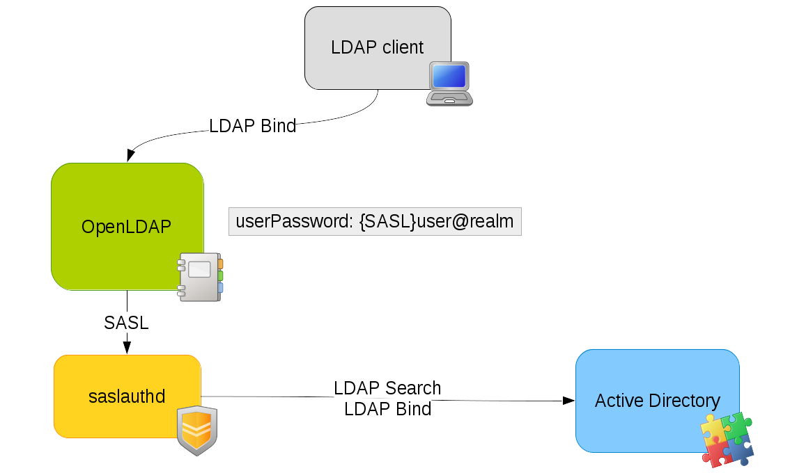
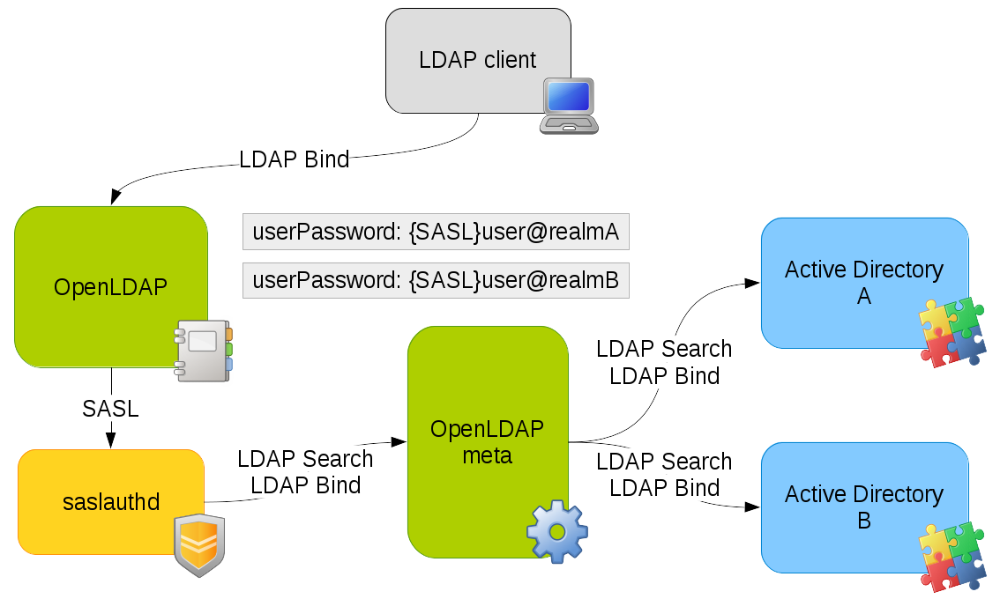

*************************************
Pass-Through authentication with SASL
*************************************

Presentation
============

Pass-Through authentication is a mechanism used by some LDAP directories to delegate authentication operations (BIND) to other backends.

It should be distinguished from the external authentication methods, that are managed by the LDAP client to authenticate on a trusted source and then connect to the directory.

Pass-Through authentication is purely transparent for LDAP clients, as they send standard authentication operations to the LDAP directory, which will then handle the delegation and forward the response to the client, as if the authentication had occured locally.

A real world use case is the coexistence between OpenLDAP and Active Directory: a notable scenario could be to let the password into AD, and configure a pass-through authentication between OpenLDAP and AD. With this setup, authentications done on the OpenLDAP are actually delegated to Active Directory.

Technical description
=====================

OpenLDAP is known to be able to use pass-through authentication. This option should be compiled into it. If not, get the sources and use this option in the configure step::

    ./configure --enable-spasswd --with-cyrus-sasl

This will allow you to store password with this syntax in userPassword attribute: ``userPassword: {SASL}user@domain``

This option is enabled by default in LDAP Tool Box OpenLDAP packages

Then you need the saslauthd daemon, which is available on most Linux distributions.

The pass-through authentication will then work like this:

    1. A BIND operation is received by OpenLDAP with parameters DN1 and PWD1
    2. OpenLDAP get DN1 entry and read userPassword attribute
    3. DN1 password is a SASL password so OpenLDAP do a SASL authentication with ``user@domain`` and PWD1 credentials
    4. SASL authentication daemon use the credentials to look for the user into the backend (for example Active Directory) and gets the matching DN, DN2
    5. SASL do a BIND operation with DN2 and PWD1
    6. The backend manage the BIND and return response to SASL
    7. SASL returns authentication status to OpenLDAP (yes/no)
    8. OpenLDAP returns response to the LDAP client

Pass-Through authentication on one LDAP directory
=================================================

.. TIP::
   This is the standard use case: the password is stored in a directory and other LDAP directories delegate authentication to it.

.. NOTE::
   This chapter allows you to use several LDAP directories as authentication backend, but only for redundancy problems: all directories will have the same data inside. To see how use several directories with different data models, go to next chapter.

Step 1: connection to the backend
---------------------------------

You need to get all connection parameters to the authentication backend. An example with Active Directory:

    :Server address: ``ldap://ad.example.com``
    :Bind DN: ``CN=Administrator,CN=Users,DC=example,DC=com``
    :Bind Password: ``ADpassword``
    :Users branch: ``CN=DomainUsers,DC=example,DC=com``

You can check these settings with an ldapsearch::

    ldapsearch -x -H ldap://ad.example.com -D CN=Administrator,CN=Users,DC=example,DC=com -w ADpassword -b CN=DomainUsers,DC=example,DC=com

Step 2: configure saslauthd
---------------------------

First, check that your SASL daemon supports LDAP::

    saslauthd -v

If not, reinstall an LDAP-aware saslauthd daemon.

Then to activate LDAP as SASL mechanism on Red-Hat systems::

    vi /etc/sysconfig/saslauthd

::

    SOCKETDIR=/var/run/saslauthd
    MECH=ldap
    FLAGS="-O /etc/saslauthd.conf"

Activate saslauthd on startup::

    chkconfig saslauthd on

To activate LDAP as SASL mechanism on Debian systems::

    vi /etc/default/saslauthd

::

    START=yes
    DESC="SASL Authentication Daemon"
    NAME="saslauthd"
    MECHANISMS="ldap"
    MECH_OPTIONS="-O /etc/saslauthd.conf"
    THREADS=5
    OPTIONS="-r -c -m /var/run/saslauthd"

Activate saslauthd on startup::

    systemctl enable saslauthd

.. NOTE::
   On Debian systems, make sure the -r option is enabled
   (combine the realm with the login before passing to authentication mechanism)::

       OPTIONS="-r -c -m /var/run/saslauthd"

To finish enter all connection information found at step one::

    vi /etc/saslauthd.conf

::

    ldap_servers: ldap://ad.example.com
    ldap_search_base: CN=DomainUsers,DC=example,DC=com
    ldap_timeout: 10
    ldap_filter: sAMAccountName=%U
    ldap_bind_dn: CN=Administrator,CN=Users,DC=example,DC=com
    ldap_password: ADpassword
    ldap_deref: never
    ldap_restart: yes
    ldap_scope: sub
    ldap_use_sasl: no
    ldap_start_tls: no
    ldap_version: 3
    ldap_auth_method: bind

Main parameters are:

    :ldap_servers: LDAP URI, space separated for redundancy
    :ldap_bind_dn: DN for connection
    :ldap_password: Password for connection
    :ldap_search_base: Search base
    :ldap_filter: Search filter
    :ldap_scope: Search scope

In parameters ``ldap_search_base`` and ``ldap_filter``, you can use these variables (example for SASL password ``user@domain``):

    * %u: ``user@domain``
    * %U: user
    * %d: domain

Restart saslauthd::

    systemctl restart saslauthd

Step 3: communication between OpenLDAP and saslauthd
----------------------------------------------------

The communication between the two daemons are done through a mutex, configured like this::

    vi /usr/lib/sasl2/slapd.conf

::

    pwcheck_method: saslauthd
    saslauthd_path: /var/run/saslauthd/mux

Add OpenLDAP user to sasl group (adapt names to your distribution settings)::

    usermod -a -G sasl ldap

Step 4: OpenLDAP configuration
------------------------------

Edit OpenLDAP configuration to configure the SASL parameters [#f1]_::

    sasl-host       localhost
    sasl-secprops   none

Restart OpenLDAP::

    systemctl restart slapd

Step 5: be proud
----------------

Now we can use the pass-through authentication. To test it, you need an account in the backend, for example::

    # Clement OUDOT, DomainUsers, example;com
    dn: CN=Clement OUDOT,OU=DomainUsers,DC=example,DC=com
    objectClass: top
    objectClass: person
    objectClass: organizationalPerson
    objectClass: user
    objectClass: inetOrgPerson
    cn: Clement OUDOT
    sn: OUDOT
    givenName: Clement
    distinguishedName: CN=Clement OUDOT,OU=DomainUsers,DC=example,DC=com
    instanceType: 4
    whenCreated: 20080617074258.0Z
    whenChanged: 20080617081856.0Z
    displayName: Clement OUDOT
    uSNCreated: 77070
    uSNChanged: 78687
    name: Clement OUDOT
    objectGUID:: TB3HuDzG8EOoUKBrMWRnyg==
    userAccountControl: 66048
    badPwdCount: 0
    codePage: 0
    countryCode: 0
    badPasswordTime: 0
    lastLogoff: 0
    lastLogon: 0
    pwdLastSet: 128581621788125000
    primaryGroupID: 513
    objectSid:: AQUAAAAAAAUVAAAAmtgimaPoR9Go86e7PQgAAA==
    accountExpires: 9223372036854775807
    logonCount: 0
    sAMAccountName: coudot
    sAMAccountType: 805306368
    userPrincipalName: coudot@example.com
    objectCategory: CN=Person,CN=Schema,CN=Configuration,DC=example,DC=com

You can test the SASL part with this command::

    testsaslauthd -u coudot -p password

Then create an account in OpenLDAP, for example::

    dn: uid=coudot,ou=users,dc=example,dc=com
    objectClass: inetOrgPerson
    objectClass: organizationalPerson
    objectClass: person
    objectClass: top
    uid: coudot
    cn: Clement OUDOT
    sn: OUDOT
    userPassword: {SASL}coudot@example.com

Now you can bind to OpenLDAP with AD password::

    ldapsearch -x -H ldap://ldap.example.com -b dc=example,dc=com -D uid=coudot,ou=users,dc=example,dc=com -w password

Pass-Through authentication on several LDAP directories - with OpenLDAP meta backend
====================================================================================

.. TIP::
   You need to install all the components of the previous chapter. This chapter will only describe the evolutions to do.

.. NOTE::
   This chapter explains how to do Pass-Through authentication on several LDAP backends with OpenLDAP meta backend. This adds complexity as SASL daemon can only be configured to connect to a single remote directory, and OpenLDAP cannot use several SASL authentication daemons. The solution described here use a meta directory between SASL daemon and remote directories. The choice of the backend to contact will be done in the SASL password value, for example ``{SASL}user@LDAP1`` and ``{SASL}user@LDAP2``.

Step 1: create the meta directory
---------------------------------

Configure a new OpenLDAP instance that will be a meta directory for the LDAP backends, for example [#f1]_::

    # Database
    database        meta
    suffix          "dc=local"
    rootdn          "cn=Manager,dc=local"
    rootpw          secret

    # LDAP 1
    uri ldap://ldap1.example.com/ou=LDAP1,dc=local

    lastmod       off
    suffixmassage   "ou=LDAP1,dc=local" "dc=example1,dc=com"
    idassert-bind bindmethod=simple
       binddn="cn=admin,dc=example1,dc=com"
       credentials="secret"
       mode=none
       flags=non-prescriptive
    idassert-authzFrom "dn.exact:cn=Manager,dc=local"

    # LDAP 2
    uri  ldap://ldap2.example.com/ou=LDAP2,dc=local

    lastmod       off
    suffixmassage "ou=LDAP2,dc=local" "dc=example2,dc=com"
    idassert-bind bindmethod=simple
      binddn="cn=admin,dc=example2,dc=com"
      credentials="secret"
      mode=none
      flags=non-prescriptive
    idassert-authzFrom "dn.exact:cn=Manager,dc=local"

Launch this server on a new port (or another server), that will be accessible from SASL dameon. For example it will be launched on `<ldap://127.0.0.1:390/>`_

Step 2: reconfigure saslauthd
-----------------------------

Adapt SASL daemon configuration to contact the meta directory::

    vi /etc/saslauthd.conf

::

    ldap_servers: ldap://127.0.0.1:390/
    ldap_search_base: ou=%d,dc=local
    ldap_timeout: 10
    ldap_filter: (|(uid=%U)(SAMACCOUNTNAME=%U))
    ldap_bind_dn: cn=Manager,dc=local
    ldap_password: secret
    ldap_deref: never
    ldap_restart: yes
    ldap_scope: sub
    ldap_use_sasl: no
    ldap_start_tls: no
    ldap_version: 3
    ldap_auth_method: bind

The interesting changes are:

    :ldap_search_base: we use the domain component (``%d``) to match to destination backend, through the meta directory DIT
    :ldap_filter: we mix the filters with an OR filter, so that the user (``%U``) will be found whatever backend is called

Restart saslauthd::

    systemctl restart saslauthd

Step 3: be really proud
-----------------------

Do the tests of the first chapter, with different users in LDAP1 and LDAP2, and appropriate users in the main OpenLDAP server. By playing with the SASL password value, you are able to choose the authentication backend for pass-through authentication.

Pass-Through authentication on several LDAP directories - with OpenLDAP ldap backend
====================================================================================

.. NOTE::
   This chapter explains how to do Pass-Through authentication on several LDAP backends with OpenLDAP ldap backend. The advantage over the meta backend is the possibility to use the rwm overlay with specific configuration for a backend directory, and for those using the cn=config backend, to manage the configuration into it (as these lines are written, backend meta is not supported in cn=config).

Step 1: create the proxy directory
----------------------------------

Configure a new OpenLDAP instance that will be a proxy directory for the LDAP backends, for example::

    # Database LDAP for local Manager authentication
    database ldap
    suffix "cn=manager,dc=local"
    rootdn "cn=manager,dc=local"
    rootpw secret
    
    # Database LDAP for LDAP 1
    database        ldap
    suffix          "ou=LDAP1,dc=local"
    
    uri ldap://ldap1.example.com
    
    idassert-bind bindmethod=simple
       binddn="cn=admin,dc=example1,dc=com"
       credentials="secret"
       mode=none
       flags=non-prescriptive
    idassert-authzFrom "dn.exact:cn=Manager,dc=local"
    
    overlay rwm
    rwm-suffixmassage   "ou=LDAP1,dc=local" "dc=example,dc=com"
    
    # Database LDAP for LDAP 2
    database        ldap
    suffix          "ou=LDAP2,dc=local"
    
    uri  ldap://ldap2.example.com
    
    idassert-bind bindmethod=simple
      binddn="cn=admin,dc=example2,dc=com"
      credentials="secret"
      mode=none
      flags=non-prescriptive
    idassert-authzFrom "dn.exact:cn=Manager,dc=local"
    
    overlay rwm
    rwm-suffixmassage   "ou=LDAP2,dc=local" "dc=example,dc=com"
    
    # Example of rwm configuration for Active Directory
    rwm-map attribute uid sAMAccountName
    rwm-map attribute * *

Step 2: reconfigure saslauthd
-----------------------------

Adapt SASL daemon configuration to contact the meta directory::

    vi /etc/saslauthd.conf

::

    ldap_servers: ldap://127.0.0.1:390/
    ldap_search_base: ou=%d,dc=local
    ldap_timeout: 10
    ldap_filter: uid=%U
    ldap_bind_dn: cn=Manager,dc=local
    ldap_password: secret
    ldap_deref: never
    ldap_restart: yes
    ldap_scope: sub
    ldap_use_sasl: no
    ldap_start_tls: no
    ldap_version: 3
    ldap_auth_method: bind

We have just changed the ``ldap_search_base`` parameter to use the domain component (``%d``) to match to destination backend, through the meta directory DIT. You can keep a simple ``ldap_filter`` parameter, as we use rwm overlay to match the login attribute in both directories.

Restart saslauthd::

    systemctl restart saslauthd

Step 3: be really proud (indeed, you are awesome)
-------------------------------------------------

Do the tests of the first chapter, with different users in LDAP1 and LDAP2, and appropriate users in the main OpenLDAP server. By playing with the SASL password value, you are able to choose the authentication backend for pass-through authentication.

.. rubric:: Footnotes

.. [#f1] example is given for a `slapd.conf <https://www.openldap.org/software/man.cgi?query=slapd.conf>`_ configuration. See `slapd-config manual <https://www.openldap.org/software/man.cgi?query=slapd-config>`_ for more information about corresponding cn=config configuration
