*********************
Self Service Password
*********************

Presentation
============

Self Service Password is a PHP application that allows users to change their password in an LDAP directory.

The application can be used on standard LDAPv3 directories (OpenLDAP, OpenDS, ApacheDS, 389 DS, RHDS, Sun Oracle DSEE, Novell,...) and also on Active Directory.

It has the following features:

    * Samba mode to change Samba passwords
    * Active directory mode
    * Local password policy:

        * Minimum/maximum length
        * Forbidden characters
        * Upper, Lower, Digit or Special characters counters
        * Reuse old password check
        * Complexity (different class of characters)

    * Help messages
    * Reset by questions
    * Reset by mail challenge (token sent by mail)
    * Reset by SMS (through external Email 2 SMS service)
    * reCAPTCHA (Google API)
    * Mail notification after password change

.. Note::
   Self Service Password code is now hosted on GitHub: `<https://github.com/ltb-project/self-service-password>`_

.. raw:: html

   
   Vote for this software:  

Documentation
=============

* `Latest release documentation <https://self-service-password.readthedocs.io/en/stable/>`_

All releases:

    * `Self Service Password v1.4 <https://self-service-password.readthedocs.io/en/v1.4/>`_
    * `Self Service Password v1.3 <https://ltb-project.org/documentation/self-service-password/1.3/start>`_
    * `Self Service Password v1.2 <https://ltb-project.org/documentation/self-service-password/1.2/start>`_
    * `Self Service Password v1.1 <https://ltb-project.org/documentation/self-service-password/1.1/start>`_
    * `Self Service Password v1.0 <https://ltb-project.org/documentation/self-service-password/1.0/start>`_
    * `Self Service Password v0.9 <https://ltb-project.org/documentation/self-service-password/0.9/start>`_
    * `Self Service Password v0.8 <https://ltb-project.org/documentation/self-service-password/0.8/start>`_
    * `Self Service Password v0.7 <https://ltb-project.org/documentation/self-service-password/0.7/start>`_
    * `Self Service Password v0.6 <https://ltb-project.org/documentation/self-service-password/0.6/start>`_
    * `Self Service Password v0.5 <https://ltb-project.org/documentation/self-service-password/0.5/start>`_
    * `Self Service Password v0.4 <https://ltb-project.org/documentation/self-service-password/0.4/start>`_
    * `Self Service Password v0.3 <https://ltb-project.org/documentation/self-service-password/0.3/start>`_

Screenshots
===========

Version 1.0
-----------

.. image:: images/ssp_1_0_change_password.png
   :alt: SSP Change password

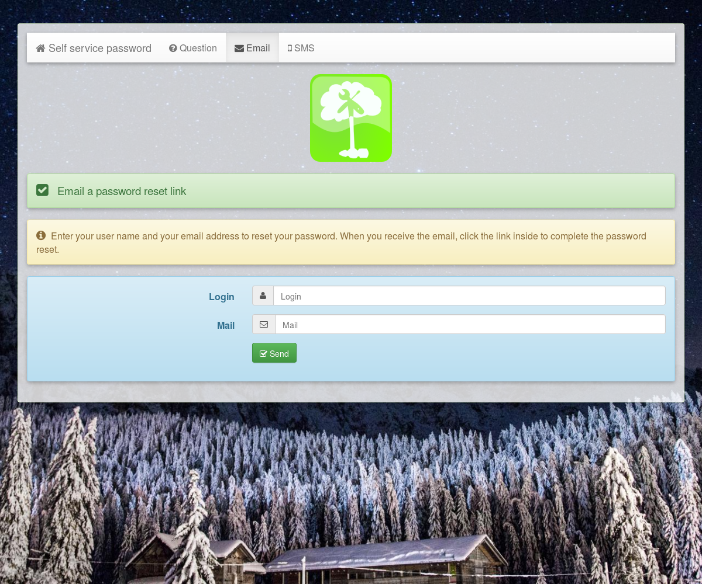

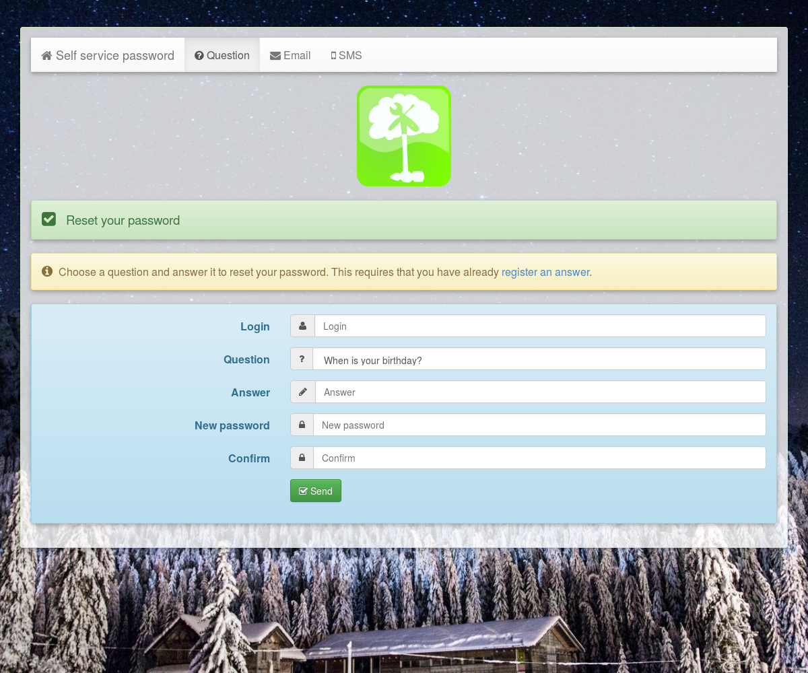

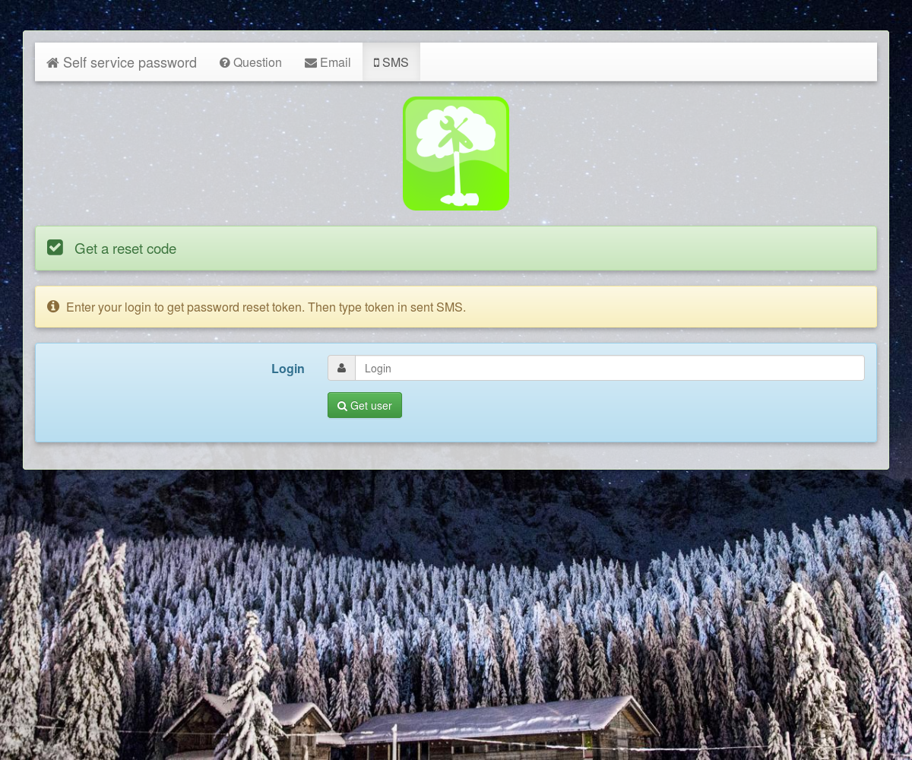

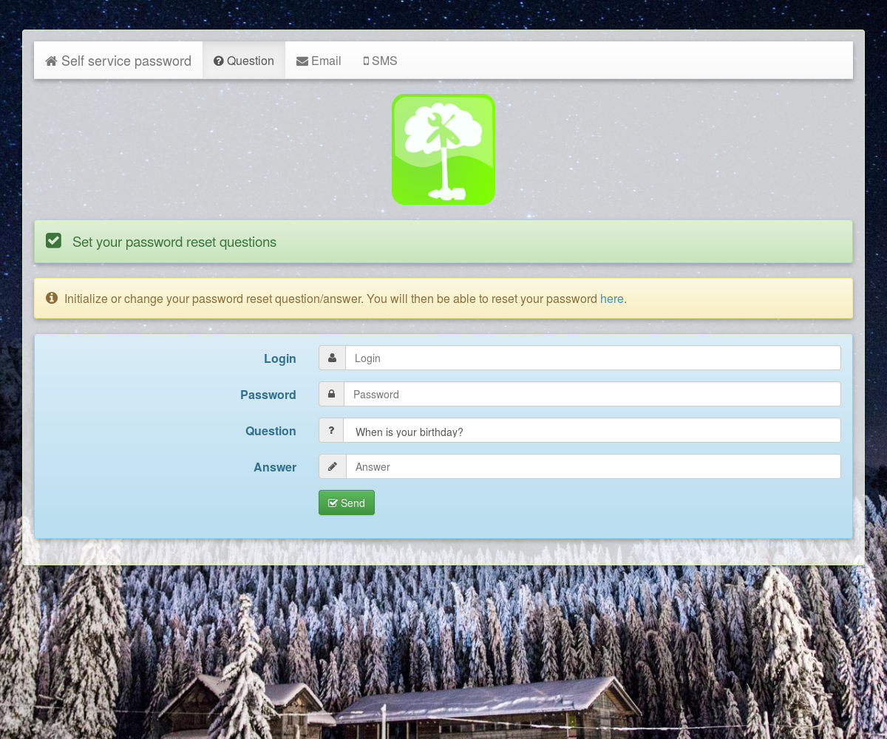

From 0.6 to 0.9
---------------

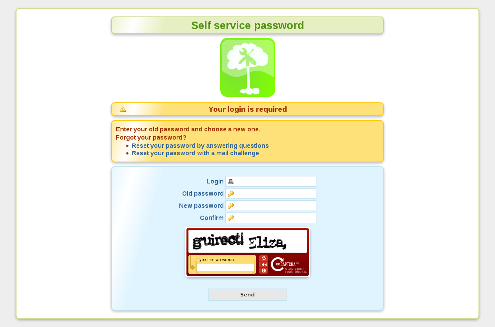

Versions 0.4 and 0.5
--------------------

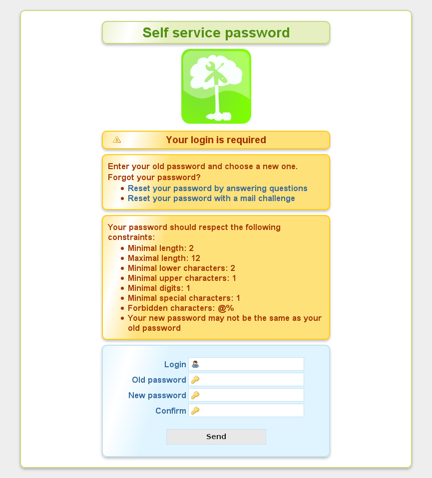

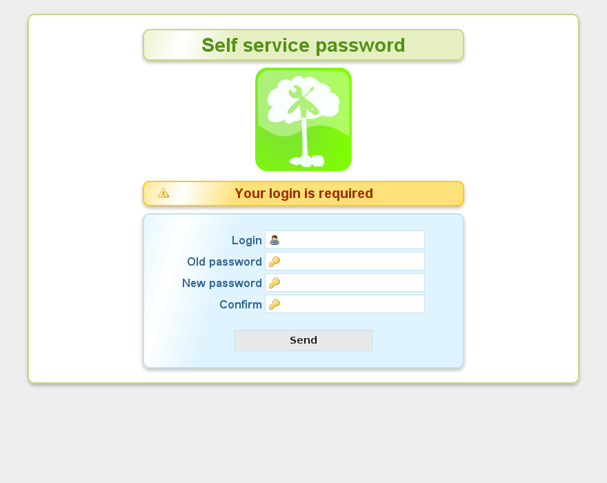

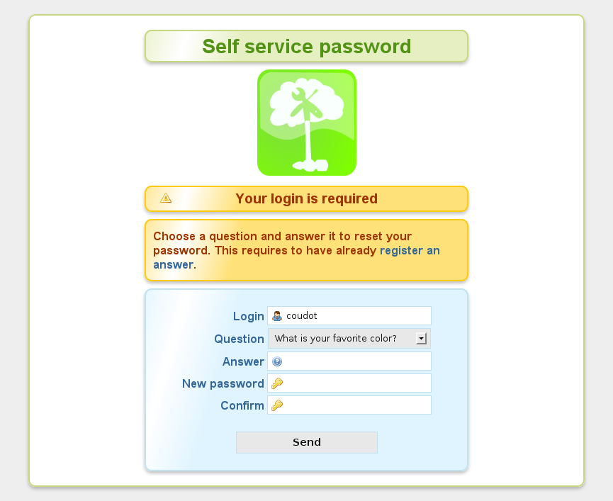

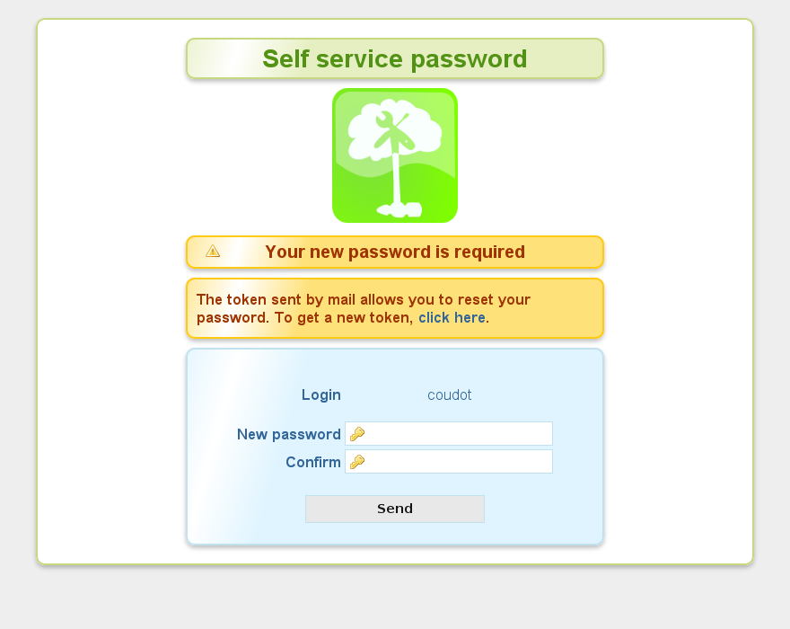

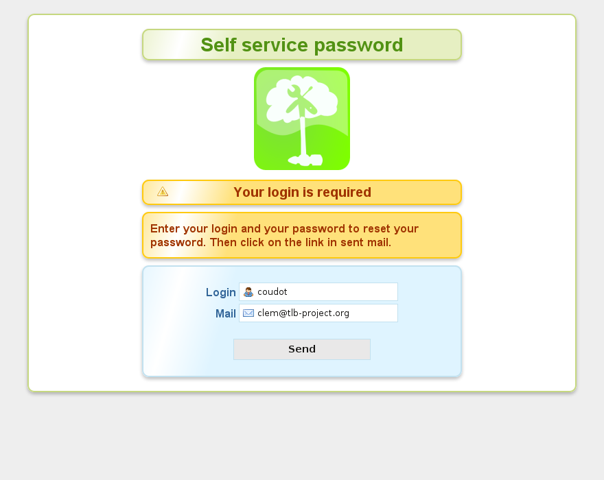

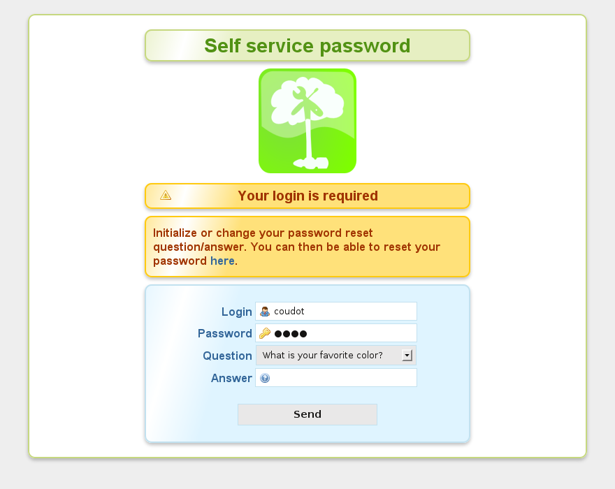

Version 0.3
-----------

.. image:: images/self_service_password.png
   :alt: SSP 0.3 screenshot 1

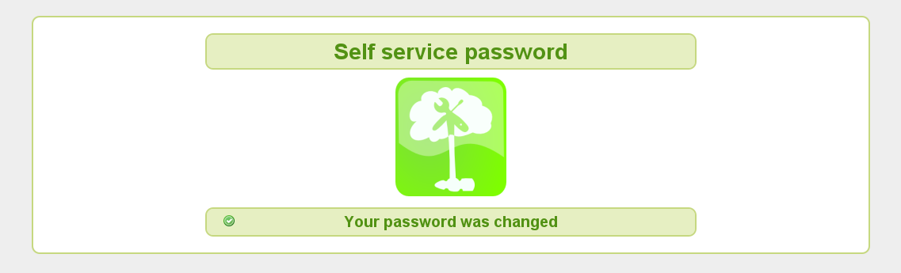

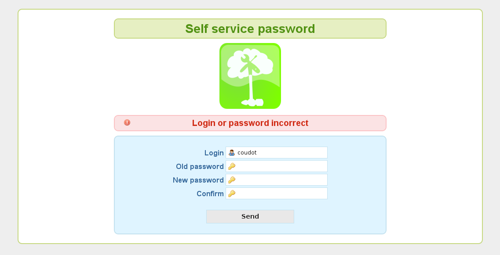

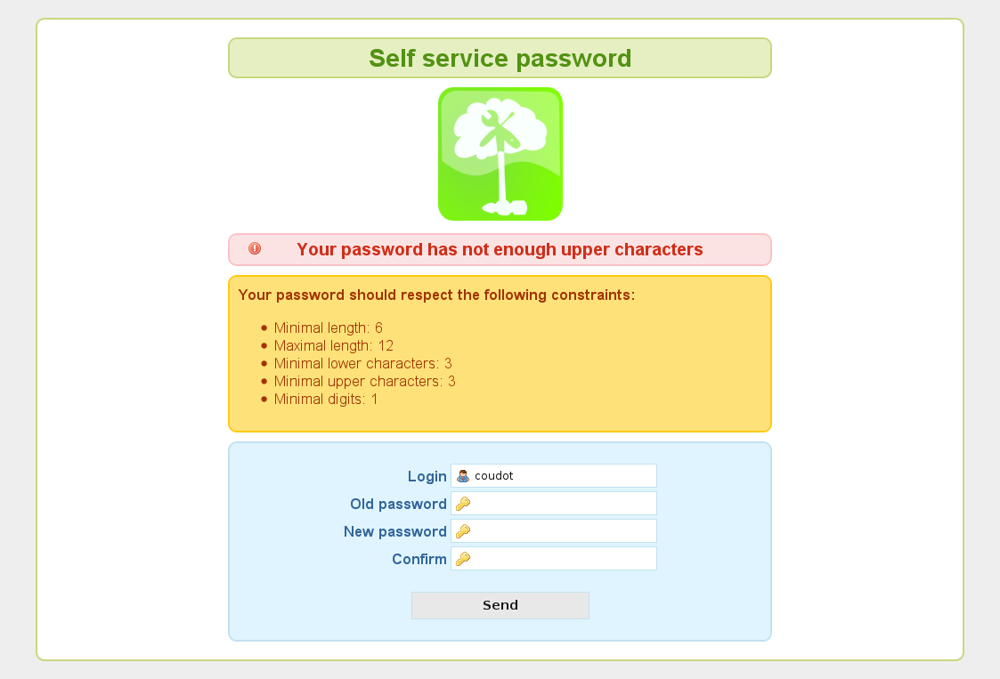

